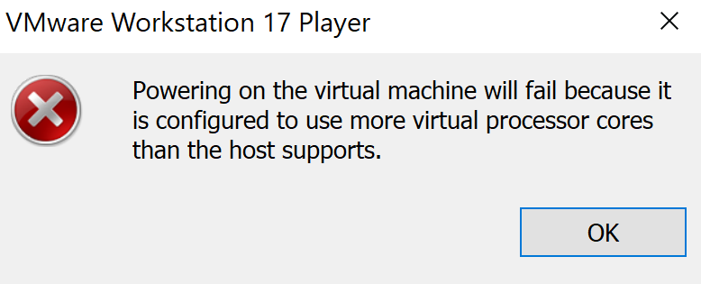

# Virtualisierung

## A) Hypervisor Typ 1 und 2

### Was ist ein Hypervisor?

Ein Hypervisor ist eine Software, die es ermöglicht, mehrere virtuelle Maschinen auf einer einzigen physischen Hardware laufen zu lassen. Es schafft die Trennung zwischen der Hardware und virtueller Maschinen, sodass verschiedene Betriebssysteme gleichzeitig auf der gleicher Hardware laufen können.

### Typ 1

Der Typ-1-Hypervisor, auch „Native“ genannt, lauft direkt auf der Hardware ohne ein zugrunde liegendes Betriebssystem. Er bietet hohe Leistung und Sicherheit, da er einen direkten Zugriff auf die Hardware hat. Beispiele sind ESXi und Microsoft Hyper-V.

### Typ 2

Der Typ-2-Hypervisor läuft nicht direkt auf der Hardware, sondern auf einem Host-Betriebssystem. Er ist einfacher für persönliche Nutzung und Entwicklung, jedoch nicht so leistungsstark und sicher wie Typ 1. Beispiele sind VirtualBox und VMware Workstation.

## B) Virtualisierungssoftware 

### Vermutung

Meine Vermutung ist es, dass es sich bei mir um den Hypervisor vom Typ 2 handelt. Der Grund für diese Vermutung ist es, meine virtuelle Software läuft auf 
VMware Workstation. 

### Testen

Man kann auf VMWare nicht mehr Prozessoren hinzufügen als man hat.

### Zusammenfassung

Der Hypervisor ist durch die physische Hardware des Hosts begrenzt.
Ich habe recherchiert, dass es meistens bei Hypervisoren vom Typ 2 der Fall ist.
Die VMWare Wokstation erlaubt mir nicht, diese Maschine zu erstellen.
Meine Vermutung hat sich bestätigt.