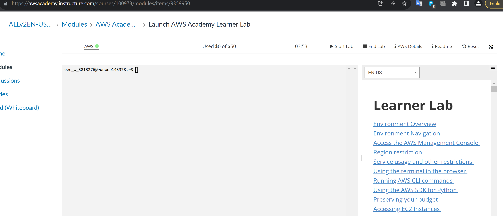
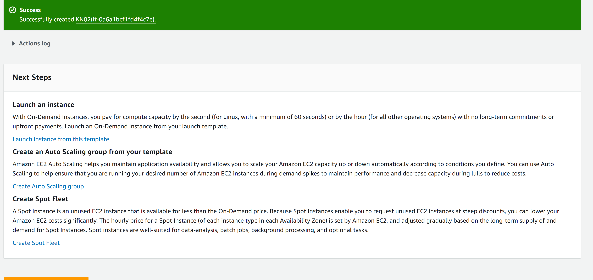
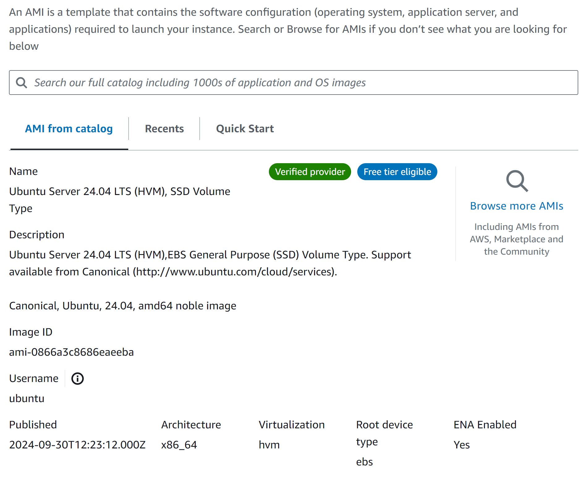
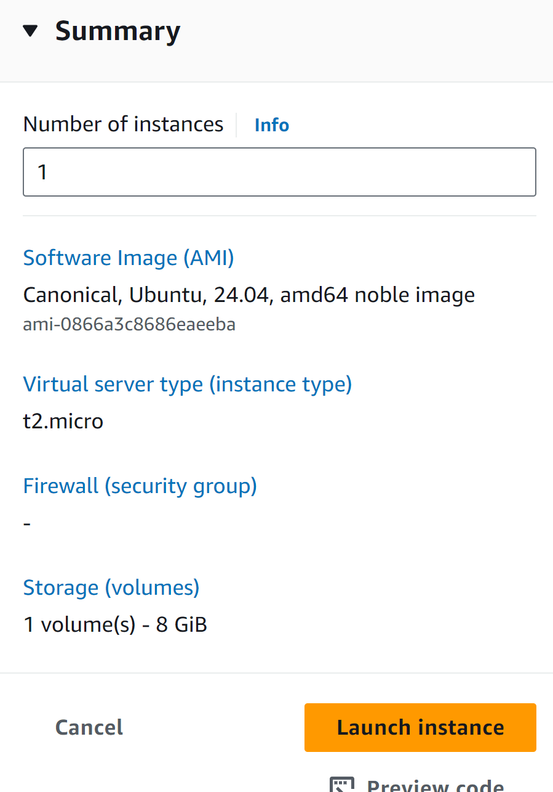
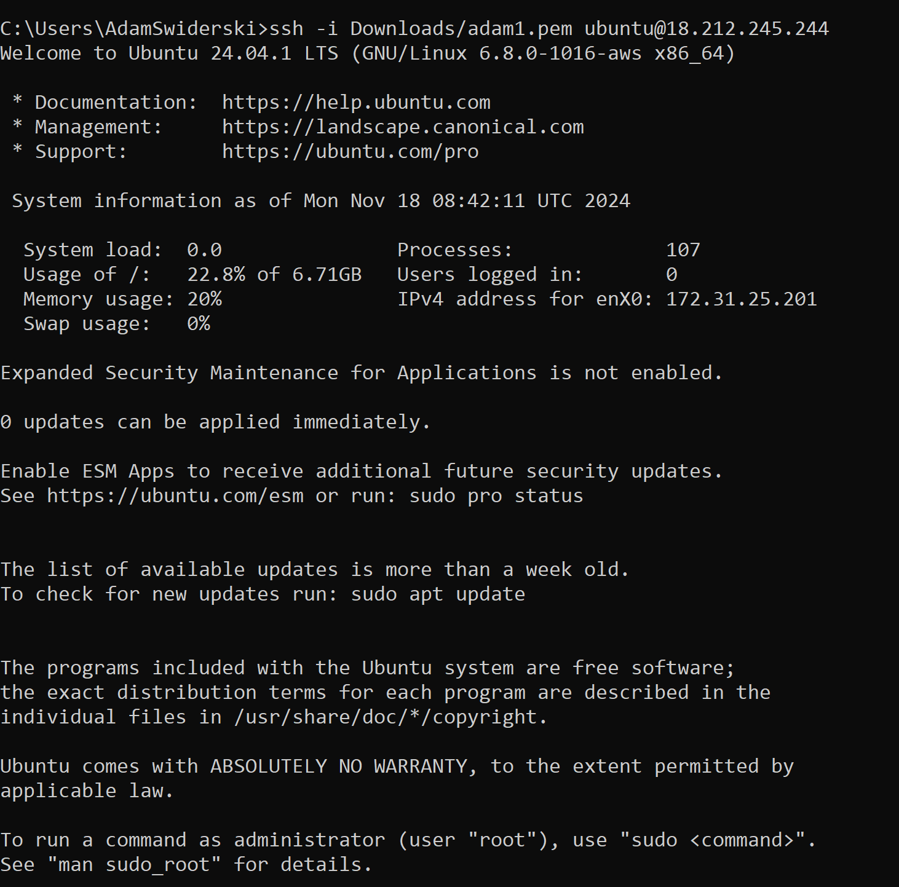
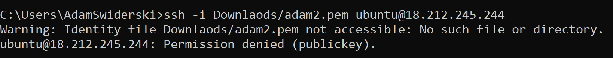
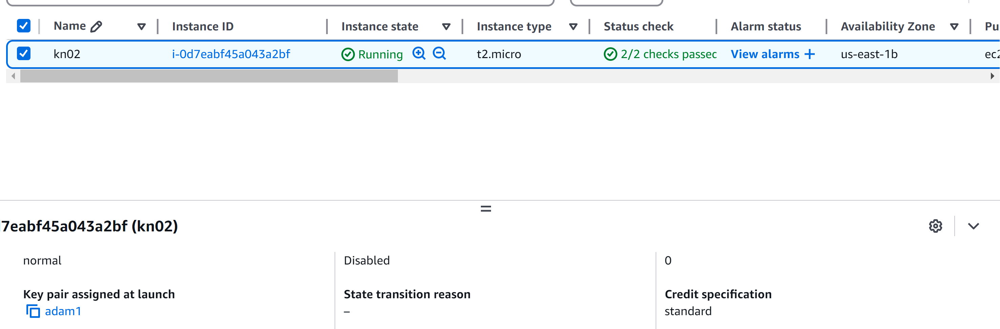

# Virtuelle Server

## A) Umgang mit AWS Kurs

## B) Instanz erstellen

Diskgrösse: 8 GiB - 1 volume

Betriebssystem: Ubuntu Server 24.04 LTS

RAM: 1 GiB

CPU: 1 vCPU

## C) Zugriff mit SSH-KEY

Man kann nur mit 1 Key sich einloggen

