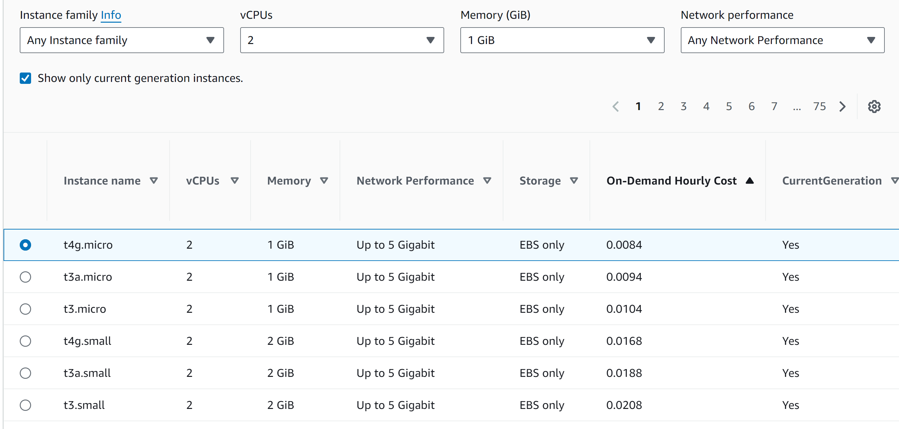
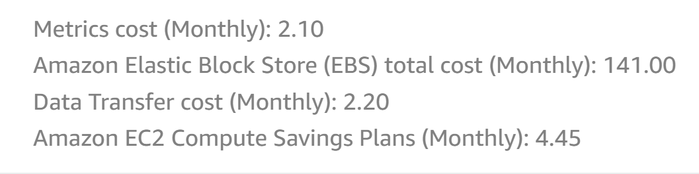
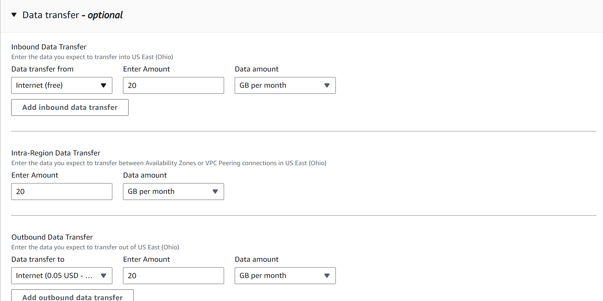
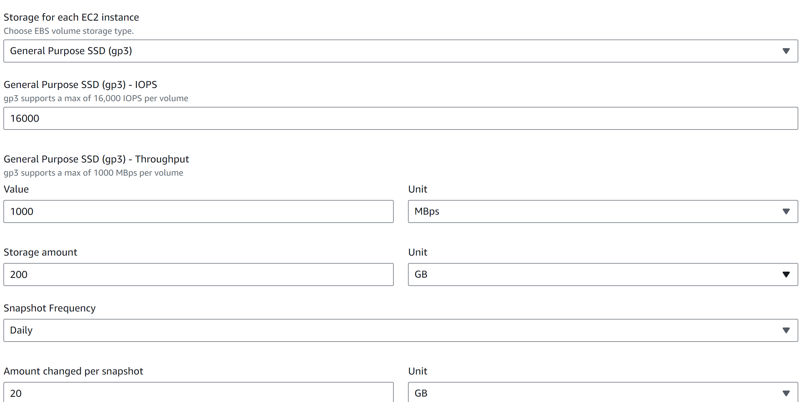
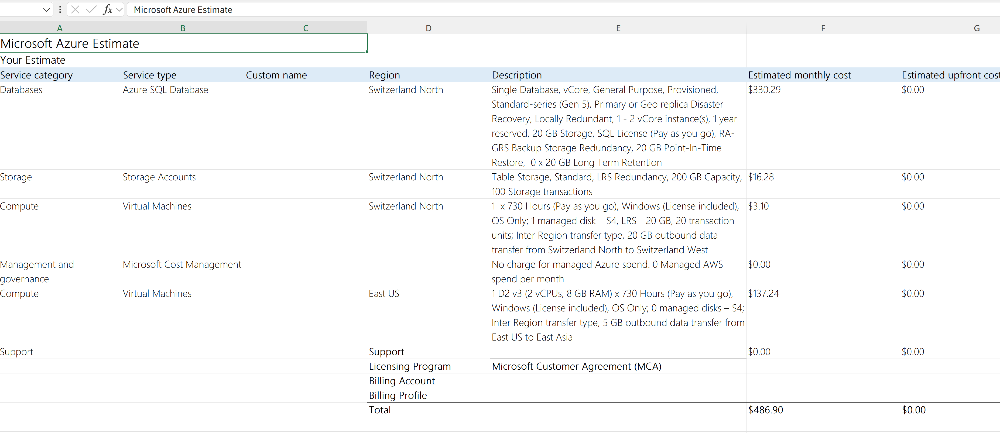

# AWS

- Compute-Instanzen: Der Webserver (t4g.micro) und der Datenbankserver (t4g.small) nutzen ARM-basierte Prozessoren, die kosteneffizienter und leistungsstark genug für 30 Benutzer sind.

- Speicher: Statt 100 GB HDD wird ein 200 GB General Purpose SSD (gp3) genutzt. SSDs bieten bessere Performance und ermöglichen Wachstum.

- Backups: AWS Snapshots ersetzen lokale Backups. Die Snapshot-Funktion ermöglicht tägliche, wöchentliche und monatliche Sicherungen effizient und kostengünstig.

- Datenübertragung: Minimale Kosten entstehen für Inbound- und Outbound-Traffic (20 GB/Monat).

- Kosteneffizienz: Einsparungen durch Savings Plans und skalierbare Cloud-Ressourcen.

# Azure

