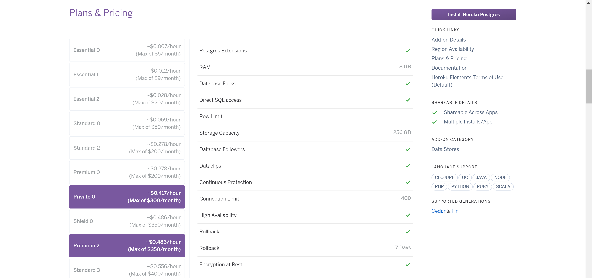
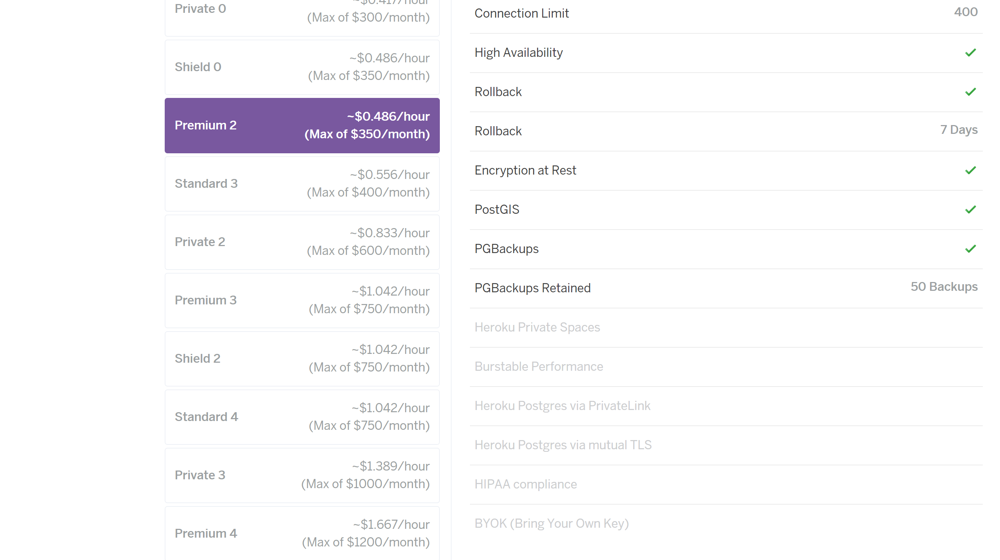
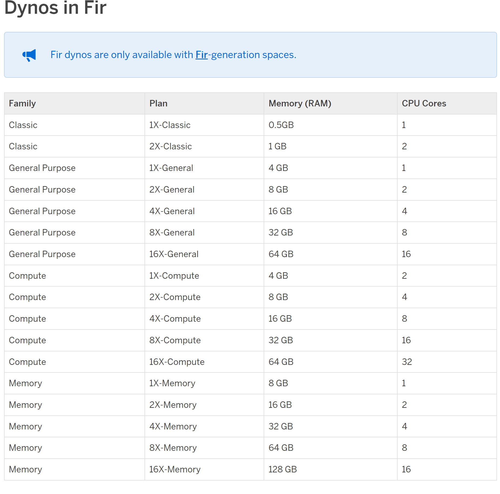

# B)

- Compute: Statt einer On-Premise-Lösung mit 1-2 Cores wurde ein 1X-Compute Dyno (2 Cores, 4 GB RAM) gewählt, der genug Leistung für die Anwendung bietet und automatisch skalierbar ist.

- Datenbank: Eine Heroku Premium 2 PostgreSQL-Instanz (256 GB Speicher, hohe Verfügbarkeit, Rollbacks) ersetzt den eigen verwalteten On-Premise-Server. Dies reduziert den Wartungsaufwand und verbessert die Sicherheit durch Verschlüsselung.

- Backups: Kontinuierliche Backups mit einer Beibehaltung von 7 Tagen werden in der Cloud automatisiert, was die Zuverlässigkeit erhöht und manuelle Prozesse eliminiert.

- Kostenoptimierung: Die Cloud-Komponenten bieten ein flexibles Pay-as-you-go-Modell, das zu niedrigeren Betriebskosten führt und Anpassungen an die tatsächliche Nutzung erlaubt.